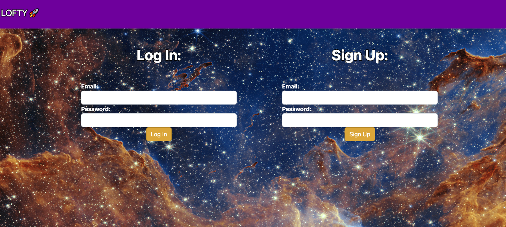
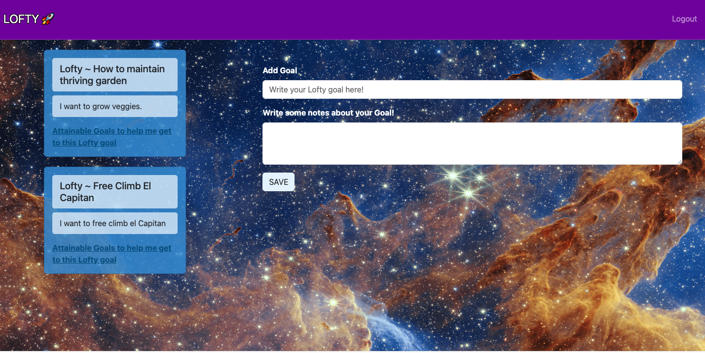
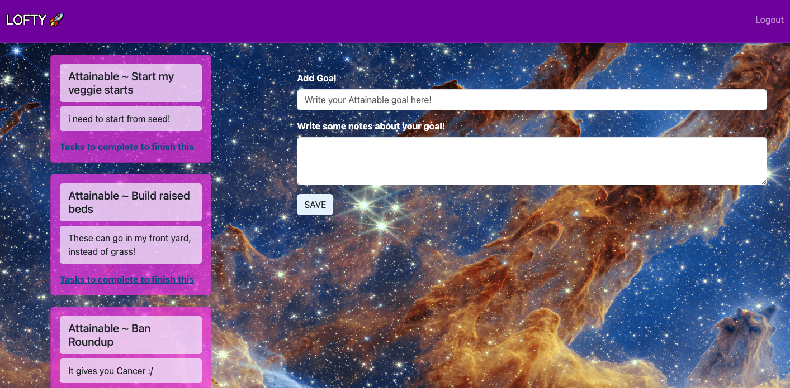
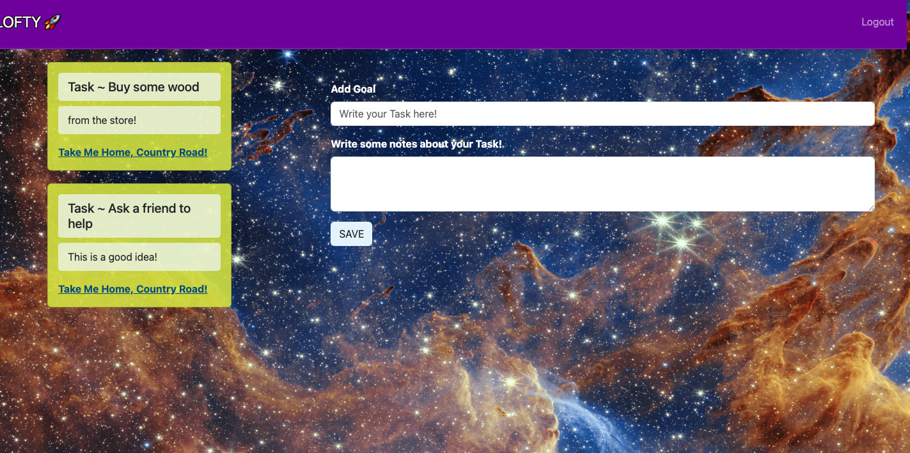

# Lofty 

## Why was this project created?
We created this app in order to break down goals into smaller actually achievable goals. Often, people have huge goals or dreams. But the overwhelm is very real. Breaking a lofty goal into smaller goals and then breaking those goals into even smaller tasks was the idea of this project.

## Technologies Used

Javascript
Handlebars JS
NodeJS
dotenv
ExpressJS
Animate.CSS
bcrypt
Bootstrap
Sequelize
MySQL
nodemon

## Link to live site & screenshots

##[Lofty](https://itsmenickfromschool.github.io/animalsWow02/)
 
Main screen/Home page

Lofty Goals

Attainable Goals

Tasks

We divided the groups based on our strengths. Everyone worked on some aspects of the frontend and the backend, we did a lot of coding together within the group in meetings, this way we all learned new skills and helped with strengths and weeknesses. Liz Made our Canva.

 Credits 

The James Webb Telescope provided our background Image

This is our [Canva presentation document](https://www.canva.com/design/DAFwKEL2kEQ/5m07ZozNEzwSv9nwD1Z1TA/edit):

The Instructional Staff at EDX helped us with learning as well as debugging help and suggestions. They include:

Stephen Woolsley (Instructor)
Trevor Overson (Teaching Assistant)
Jacek Hacking (Teaching Assistant)
CJ Sanders (Teaching Assistant)

